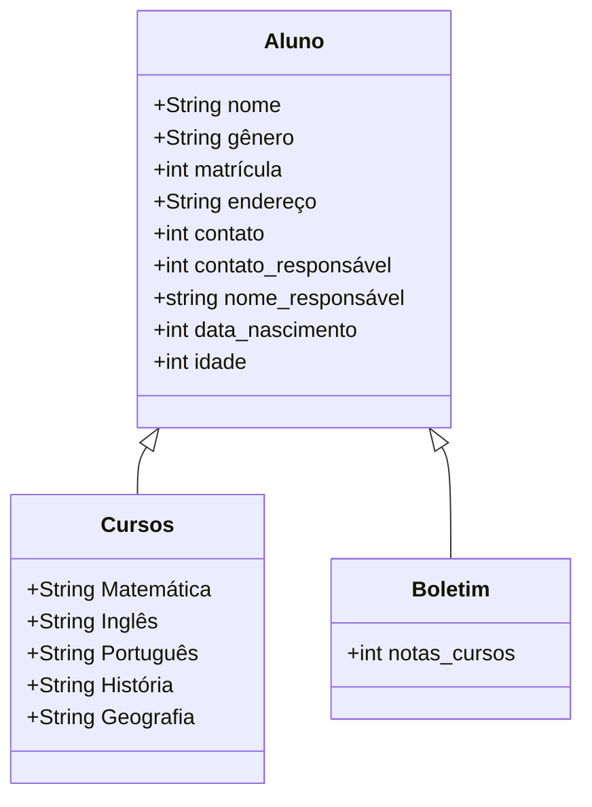

# projeto-cadastro-de-alunos
Projeto integrador da equipe de progrmador de sistemas do curso do Senac

Matrícula do Aluno (README)

1.Esse programa realiza uma matrícula, consúlta e exclusão de alunos de uma lista, coletando seus dados e os dados do seu responsável.

1.1. Matrícula de Alunos. Ao matrícular o aluno é inserido o nome, data de nascimento, email, contato, rua, bairro e número de residência, nome do responsável e contato do responsável, RG do aluno, grau de escolaridade. Seus dados são salvos e é gerado uma matrícula de 10 dígitos de acordo com o ano, mês e ordem de matrícula no mês e ano.

1.2. Consulta de Alunos. Com a matrícula que é gerada ao matricular o aluno, você poderá ter a opção de consultar todas as informações do aluno, somente os dados do responsável ou ver a lista de todos os alunos com o nome e matrícula.

1.3. Excluir Alunos. Você poderá pesquisar o aluno que deseja excluir com o uso da matrícula do mesmo. Ao inserir a matrícula o programa retornará com uma pergunta para confirmação da exclusão do aluno, mostrando seu nome e matrícula. Caso o usuário queira confirmar a exclusão deve digitar "s" e teclar "Enter", caso deseje cancelar será necessário apenas declar "Enter".

Diagrama 

