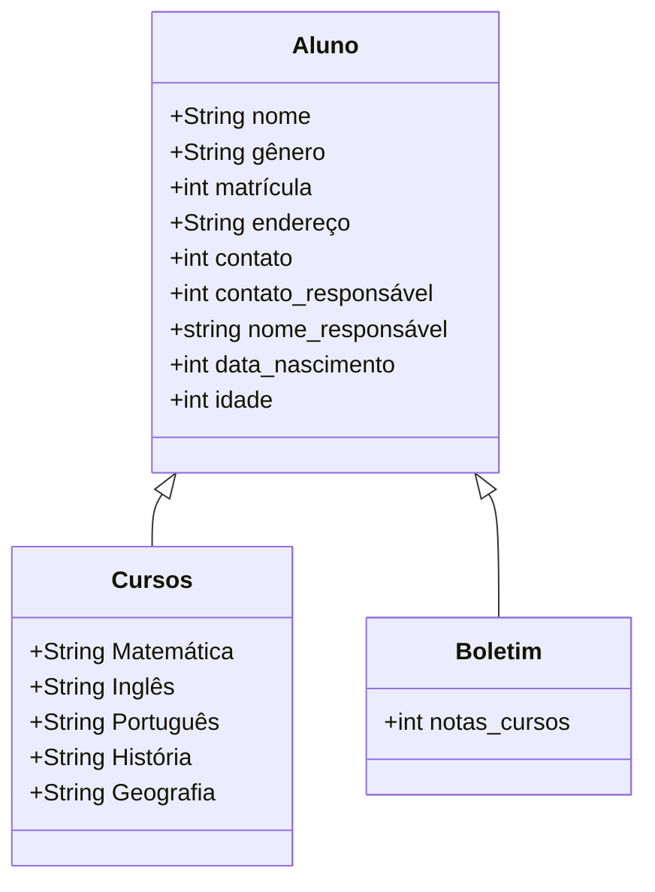

# Sistema de Gerenciamento de Alunos Do Curso de Progamação do Senac

Este script em Python implementa um sistema simples de gerenciamento de alunos que permite aos usuários cadastrar, consultar e excluir registros de alunos. Abaixo está uma visão geral das funcionalidades e estrutura do código:

## Funcionalidades

### Cadastro de Aluno (cadastrar_aluno()):

- *Solicitação de Dados:*
  - Nome completo do aluno.
  - Data de nascimento do aluno, validada para garantir que o aluno tenha pelo menos 4 anos de idade.
  - E-mail válido do aluno.
  - Endereço completo do aluno, incluindo rua, bairro e número da residência.
  - Número de contato do aluno, formatado para padrão local.
  - Nome completo do responsável pelo aluno.
  - Número de contato do responsável, formatado para padrão local.
  - Número de identidade do aluno, formatado com dígitos e separador.
  - Grau de escolaridade do aluno.

- *Geração Automática de Matrícula:*
  - Cada aluno cadastrado recebe uma matrícula única, baseada na data e hora do cadastro.

### Consulta de Aluno (consultar_aluno()):

- *Consulta por Matrícula:*
  - Permite buscar alunos específicos usando sua matrícula única gerada no cadastro.
  - Exibe todos os detalhes cadastrados do aluno encontrado, incluindo nome, data de nascimento, idade, e-mail, endereço, contato, responsável, grau de escolaridade, matrícula e identidade.

- *Consulta de Dados dos Responsáveis:*
  - Além dos detalhes do aluno, oferece a opção de consultar apenas os dados do responsável pelo aluno encontrado.

- *Listagem de Todos os Alunos Matriculados:*
  - Apresenta uma lista completa de todos os alunos atualmente registrados no sistema, exibindo seus nomes e matrículas.

### Exclusão de Aluno (excluir_aluno()):

- *Remoção Segura de Dados:*
  - Permite excluir um aluno do sistema após confirmação do usuário, usando a matrícula como identificador único.
  - Confirmação solicitada para evitar exclusões acidentais.

### Menu Principal (menu()):

- *Interface Interativa:*
  - Apresenta um menu claro com opções numeradas para facilitar a navegação.
  - Limpa a tela do console entre transições de menu para melhorar a experiência do usuário.
    ## :cyclone: Fluxo Principal De Requisitos:
1. O usuário seleciona a opção "Adicionar Novo Aluno".
2. O sistema solicita as informações do aluno (nome, idade, matrícula, curso).
3. O usuário insere as informações e confirma.
4. O sistema valida as informações e adiciona o novo aluno no banco de dados.
5. O sistema confirma a adição do aluno e exibe os detalhes inseridos.

## :sparkles: Características do Cadastro de Alunos

A proposta é de criar um sistema deinformação, que colete os seguintes dados:

* Nome do Aluno
* Data de Nascimento
* Gênero
* Responsável
* CPF do aluno
* CPF do responsável
* Estado
* Cidade
* CEP
* Endereço e numero
* Num. Celular do ALuno
* Num. Celular do Responsável
* Grau de Escolaridade

> O programa deve receber esses dados, editar esses dados, atualizar esses dados e deletar esses dados.

### :space_invader: Backend
Menu Principal: 

 1. Cadastrar Aluno
 2. Consultar Aluno
 3. Excluir Aluno  
 4. Sair
 Digite sua opção: 
 --> 
`           `

- Funcionalidades essenciais: adicionar aluno, excluir aluno, consultar aluno.
- Classifique os dados segundo os tipos das variáveis (numéricos, literais ou lógicos) que irão armazená-los.

Variáveis literais: nome do aluno, sexo, endereço, cidade, estado, nome do pai, nome da mãe.
Variáveis numéricas: telefone, CEP, RG, data de nascimento, grau de escolaridade.

### :computer: Frontend

- Menu de Ações do APP:
  - Cadastrar ALuno
  - Consultar ALuno
  - Excluir Aluno
  - Listar Alunos
  - Sair

- Janelas para cada ação executada pelo usuário

- Janela de Erro - Atributo vazio

## Colaboradores
### :ghost: RESPONSAVEIS PELO README E O CONSULTAR ALUNO
<table>
  <tbody>
    <tr>
      <td align="center" valign="top" width="14.28%"><a href="https://jocile.com/Programador/Python/testes/Testes+automatizados+exemplo"> <b>Marcos David e Marcos Graziel</b></a> <a href="https://github.com/codesandbox/codesandbox-client/commits?author=donavon" title="Code">💻</a></td>
    </tr>
  </tbody>
</table>

### :robot: RESPONSAVEIS POR CADASTRAR E EXCLUIR ALUNO E A CRIAÇÃO DOS DIAGRAMAS DE CASO DE USO E DESCREVENDO PROJETO

<table>
  <tbody>
    <tr>
      <td align="center" valign="top" width="14.28%"><a href="https://jocile.com/Programador/Python/testes/Testes+automatizados+exemplo"> <b>Davi Andrade e Erick Jansen</b></a> <a href="https://github.com/codesandbox/codesandbox-client/commits?author=donavon" title="Code">💻</a></td>
    </tr>
  </tbody>
</table>

### :frog: RESPONSAVEIS PELO FRONT END, BANCO DE DADOS E REQUISITOS

<table>
  <tbody>
    <tr>
      <td align="center" valign="top" width="14.28%"><a href="https://jocile.com/Programador/Python/testes/Testes+automatizados+exemplo"> <b>Kauã e Madson</b></a> <a href="https://github.com/codesandbox/codesandbox-client/commits?author=donavon" title="Code">💻</a></td>
    </tr>
  </tbody>
</table>

## Execução do Programa

Para executar o programa, basta rodar o script Python. O menu principal guiará o usuário através das opções disponíveis para interação com o sistema de gerenciamento de alunos.

## Melhorias Futuras

- Implementação de tratamento de erros mais robusto para garantir a integridade dos dados.
- Persistência de dados utilizando um banco de dados para armazenamento durável.
- Melhorias na interface do usuário para uma experiência mais intuitiva.
- Adição de funcionalidades como atualização de registros de alunos.

Este sistema foi desenvolvido como parte de um projeto colaborativo envolvendo os colaboradores listados acima, cada um contribuindo com sua expertise para o seu desenvolvimento e aprimoramento.
=======
# projeto-cadastro-de-alunos
Projeto integrador da equipe de progrmador de sistemas do curso do Senac

Matrícula do Aluno (README)

1.Esse programa realiza uma matrícula, consúlta e exclusão de alunos de uma lista, coletando seus dados e os dados do seu responsável.

1.1. Matrícula de Alunos. Ao matrícular o aluno é inserido o nome, data de nascimento, email, contato, rua, bairro e número de residência, nome do responsável e contato do responsável, RG do aluno, grau de escolaridade. Seus dados são salvos e é gerado uma matrícula de 10 dígitos de acordo com o ano, mês e ordem de matrícula no mês e ano.

1.2. Consulta de Alunos. Com a matrícula que é gerada ao matricular o aluno, você poderá ter a opção de consultar todas as informações do aluno, somente os dados do responsável ou ver a lista de todos os alunos com o nome e matrícula.

1.3. Excluir Alunos. Você poderá pesquisar o aluno que deseja excluir com o uso da matrícula do mesmo. Ao inserir a matrícula o programa retornará com uma pergunta para confirmação da exclusão do aluno, mostrando seu nome e matrícula. Caso o usuário queira confirmar a exclusão deve digitar "s" e teclar "Enter", caso deseje cancelar será necessário apenas declar "Enter".

Diagrama descrevendo o projeto:

Diagrama de casos de uso:

